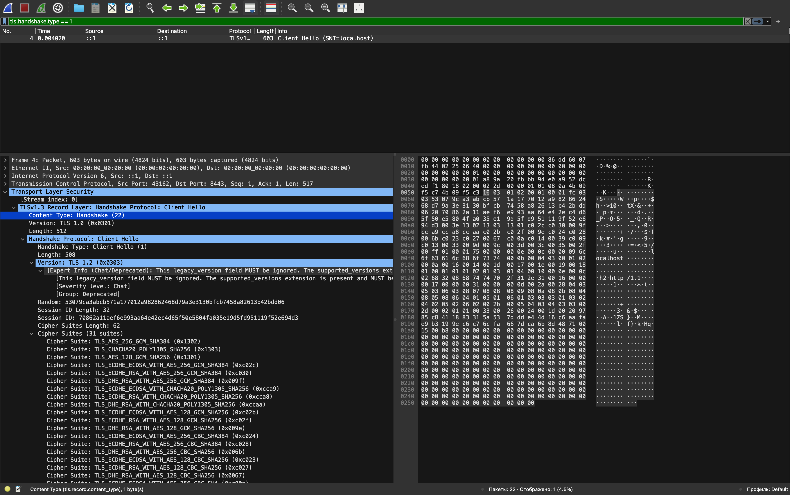
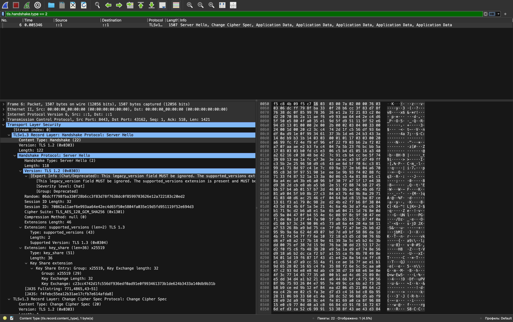

# Lab 4 — OS & Networking: Trace, Debug, and Read the Substrate

**Author:** Kolpakova Valeriia — v.kolpakova@innopolis.university

**Environment:** my host is macOS, where `ss`, `ip`, `journalctl` and `iptables` do not exist,
so the whole lab was run inside an `ubuntu:24.04` container (`--cap-add=NET_ADMIN
--cap-add=NET_RAW`, QuickNotes source bind-mounted, Go 1.24.0). Commands ran as root there, so
the `sudo` prefix from the lab text is absent from mine. Nothing below is simulated — every
packet was captured off a real loopback interface.

---

## Task 1 — Trace a Request End-to-End

### 1.1 — Start QuickNotes + capture

```bash
cd app/ && go run .
# 2026/09/17 20:35:59 quicknotes listening on :8080 (notes loaded: 4)

tcpdump -i lo -nn -s 0 -A 'tcp port 8080' -w lab4-trace.pcap &

curl -v -X POST http://localhost:8080/notes \
  -H 'Content-Type: application/json' \
  -d '{"title":"trace me","body":"in flight"}'
```

The request returned `201 Created` with
`{"id":5,"title":"trace me","body":"in flight","created_at":"2026-09-17T20:36:24.973418384Z"}`.
curl resolved `localhost` to both families and preferred IPv6, so the capture below is
`::1 → ::1` rather than `127.0.0.1`.

### 1.2 — Decode the capture

```bash
tcpdump -r lab4-trace.pcap -nn -A | tee lab4-trace.txt
```

Full output: [`lab4-trace.txt`](lab4-trace.txt) · raw capture: [`lab4-trace.pcap`](lab4-trace.pcap)

Ten packets, annotated:

| # | Timestamp | Direction | Flags / payload | What it is |
|---|---|---|---|---|
| 1 | `20:36:24.970892` | client → server | `[S]` seq 3306560840 | **SYN** — handshake opens |
| 2 | `.970954` | server → client | `[S.]` seq 1148545574, ack 3306560841 | **SYN/ACK** — server accepts, acks `seq+1` |
| 3 | `.970962` | client → server | `[.]` ack 1 | **ACK** — handshake complete |
| 4 | `.971525` | client → server | `[P.]` len 174 — `POST /notes HTTP/1.1` + JSON | **HTTP request** |
| 5 | `.971530` | server → client | `[.]` ack 175 | TCP ack of the request bytes |
| 6 | `.975290` | server → client | `[P.]` len 206 — `HTTP/1.1 201 Created` + JSON | **HTTP response** |
| 7 | `.975302` | client → server | `[.]` ack 207 | client acks the response |
| 8 | `.975460` | client → server | `[F.]` | **FIN** — client half-closes |
| 9 | `.975557` | server → client | `[F.]` | **FIN** — server half-closes |
| 10 | `.975587` | client → server | `[.]` ack 208 | final ACK — connection closed |

**Handshake** (packets 1–3):

```
20:36:24.970892 IP6 ::1.50152 > ::1.8080: Flags [S],  seq 3306560840, win 65476, ...
20:36:24.970954 IP6 ::1.8080 > ::1.50152: Flags [S.], seq 1148545574, ack 3306560841, ...
20:36:24.970962 IP6 ::1.50152 > ::1.8080: Flags [.],  ack 1, win 512, ...
```

**HTTP request** (packet 4), ASCII payload inline thanks to `-A`:

```
POST /notes HTTP/1.1
Host: localhost:8080
User-Agent: curl/8.5.0
Accept: */*
Content-Type: application/json
Content-Length: 39

{"title":"trace me","body":"in flight"}
```

**HTTP response** (packet 6):

```
HTTP/1.1 201 Created
Content-Type: application/json
Date: Thu, 17 Sep 2026 20:36:24 GMT
Content-Length: 93

{"id":5,"title":"trace me","body":"in flight","created_at":"2026-09-17T20:36:24.973418384Z"}
```

**Close** (packets 8–10): client `FIN`, server `FIN` (its ACK of the client FIN rides along on
the same segment), final `ACK`. No `RST`, so nothing aborted the connection.

### 1.3 — The five debugging commands

**1. What's listening?**

```console
$ ss -tlnp | grep :8080
LISTEN 0  4096  *:8080  *:*  users:(("quicknotes",pid=6179,fd=3))
```

*Why:* it answers three questions at once — a process exists, it holds the port, and it bound
to `*:8080` (all interfaces) rather than `127.0.0.1:8080` (loopback only). That last
distinction is the difference between "reachable from a proxy or another host" and "reachable
only from here", and it is invisible in the application's own logs.

**2. Routes from this host**

```console
$ ip route show
default via 172.17.0.1 dev eth0
172.17.0.0/16 dev eth0 proto kernel scope link src 172.17.0.2
```

*Why:* asks where a packet goes if it is *not* local. Relevant when traffic that should stay
local escapes to a gateway, or when a missing default route makes everything external fail
while localhost still looks healthy.

**3. Reachability**

```console
$ mtr -rwc 5 localhost
HOST: ec011b22c654   Loss%  Snt  Last  Avg  Best  Wrst  StDev
  1.|-- localhost     0.0%    5   0.1  0.1   0.1   0.2    0.1
```

*Why:* establishes the shape of a healthy path — one hop, 0 % loss — so a real path with loss
at hop 3 is recognisable. `mtr` beats `ping` because it separates per-hop loss from end-to-end
loss.

**4. DNS**

```console
$ dig +short example.com @1.1.1.1
172.66.147.243
104.20.23.154
```

*Why:* deliberately bypasses the local resolver and asks a known-good public one. If this works
but the app's lookups fail, the fault is in `/etc/resolv.conf`, the stub resolver or search
domains — it splits "DNS is broken" into "*whose* DNS is broken".

**5. Service logs**

```console
$ journalctl --user -u quicknotes -n 20 || true
bash: line 1: journalctl: command not found
```

*Why:* the journal is where a service's own account of its startup lives. Negative result here:
this container has no systemd and QuickNotes was started with `go run .`, not as a unit — which
is why the lab guards the command with `|| true`. The substitute that did exist was the
process's stdout redirected to a file, and that gap is the subject of the Task 2 postmortem.

### 1.4 — What would I check first on a 502?

A 502 is emitted by a **gateway**, not by QuickNotes — it means a proxy in front of the app
asked upstream and got back nothing usable. So the first move is not to read application logs,
it is to **bisect the path**: `curl -s -o /dev/null -w '%{http_code}\n'
http://localhost:8080/health` directly against the app, bypassing the proxy. If that returns
`200`, QuickNotes is healthy and the fault lives between proxy and app — a wrong upstream
host/port in the proxy config, a stale DNS name the proxy cached, or the mismatch `ss -tlnp`
exposes in one line: the app bound to `127.0.0.1:8080` while the proxy dials it across an
interface, so the connection is refused before any HTTP is spoken. If the direct curl *also*
fails, the proxy is innocent and the app is the problem; then `ss -tlnp | grep :8080` (is it
even listening?), then `ps` and the process's stderr for a crash or a failed bind. Reading logs
first usually wastes the first ten minutes, because a 502 is a statement about the *path*, and
only the path can say which side to open.

---

## Task 2 — Outside-In Debugging on a Broken Deploy

### 2.1 — Reproduce the break

With one instance already holding `:8080`, a second one was started on the same port:

```bash
ADDR=:8080 go run .
```

Exact error, exit status `1`:

```
2026/09/17 20:37:25 quicknotes listening on :8080 (notes loaded: 5)
2026/09/17 20:37:25 listen: listen tcp :8080: bind: address already in use
exit status 1
```

Note the order of those two lines. In [`app/main.go`](../app/main.go) the log call sits
**before** `srv.ListenAndServe()` inside the goroutine, so it fires unconditionally, a fraction
of a millisecond before the bind is even attempted:

```go
go func() {
    log.Printf("quicknotes listening on %s (notes loaded: %d)", addr, store.Count())
    if err := srv.ListenAndServe(); err != nil && !errors.Is(err, http.ErrServerClosed) {
        log.Fatalf("listen: %v", err)
    }
}()
```

### 2.2 — The outside-in chain

**1) Is it running?**

```console
$ ps -ef | grep quicknotes | grep -v grep
root  4465  0     bash -c go run . > /tmp/quicknotes.log 2>&1
root  6179  4471  /tmp/go-build2755708415/b001/exe/quicknotes
```

**Decision:** exactly one compiled binary is alive (pid 6179), not two. The second instance
never became a process I could find — it died during startup, so the failure is at bind time,
not at run time. Keep walking outward.

**2) Is it listening?**

```console
$ ss -tlnp | grep 8080
LISTEN 0  4096  *:8080  *:*  users:(("quicknotes",pid=6179,fd=3))
```

**Decision:** the port is held by pid 6179 — the *first* instance. One listener, one owner. This
is contention over a single resource and the survivor is the older process; the port is not
broken, it is taken.

**3) Reachable from the host?**

```console
$ curl -s -o /dev/null -w "%{http_code}\n" http://localhost:8080/health
200
```

**Decision:** this reframes the incident. The service is fine — the surviving instance serves
traffic normally. There is no user-facing outage; what failed is a *deployment*, silently. Had
I been paged on "deploy failed" and checked only the endpoint, I would have closed the ticket
as "cannot reproduce" while the new version was in fact never running.

**4) Firewall blocking?**

```console
$ iptables -L -n -v
Chain INPUT (policy ACCEPT 0 packets, 0 bytes)
Chain FORWARD (policy ACCEPT 0 packets, 0 bytes)
Chain OUTPUT (policy ACCEPT 0 packets, 0 bytes)
```

**Decision:** all chains empty, policy `ACCEPT` — rule out the firewall. The zero counters are
consistent with a working loopback service rather than evidence against one, since this traffic
never traverses these chains.

**5) DNS?**

```console
$ dig +short localhost
198.18.212.211
```

**Decision:** surprising, but irrelevant to this incident. `dig` queries the DNS server directly
and deliberately bypasses `/etc/hosts`, where `localhost` is correctly mapped to `127.0.0.1`
and `::1` — and that NSS path is the one QuickNotes and curl actually use, which is why the
service works despite a nonsense DNS answer. (The answer itself came from `1.1.1.1` with the
authoritative flag set and TTL 1, pointing into the RFC 2544 benchmark range — a DNS
interceptor on this network rewriting the response, not a genuine upstream answer.) Worth
writing down precisely because believing `dig` over `/etc/hosts` here would have sent me
chasing a phantom.

### 2.3 — Repair and re-verify

```console
$ kill 6179          # release the port held by the first instance
$ ss -tlnp | grep 8080
                     # (empty — port freed)

$ ADDR=:8080 go run . &
2026/09/17 20:38:11 quicknotes listening on :8080 (notes loaded: 5)

$ curl -s http://localhost:8080/health
{"notes":5,"status":"ok"}
```

Port released, fresh instance bound cleanly, health endpoint answers with valid JSON, and the
note count is `5` — the note created during the Task 1 trace survived the restart.

### 2.4 — Root cause and blameless postmortem

**Root cause:** `listen tcp :8080: bind: address already in use` — two processes were asked to
own one TCP port; the kernel gave it to the first and refused the second.

**Mini-postmortem (188 words).**

Nobody mistyped anything. The second instance was started exactly as documented and failed
structurally: nothing enforced that only one process could own `:8080`, so the constraint was
discovered by collision rather than prevented by design.

Three things made it worse. The application logs `quicknotes listening on :8080` *before*
`ListenAndServe` returns, so the log asserts success moments before the bind fails — anyone
reading logs alone sees a healthy start. The process was launched with `&`, so its non-zero
exit status went nowhere; no supervisor was watching. And the only durable signal was a line on
stderr that a fire-and-forget shell discards. A deploy can therefore fail completely while logs
and the health endpoint look green, because the endpoint is served by the *old* process.

What would prevent it, none of which asks anyone to be more careful: run under a supervisor
that owns the port and refuses duplicates; make readiness a `curl /health` probe against the
new process rather than a log line; log *after* a successful `net.Listen`, not before; and
pre-check `ss -tlnp | grep :8080` in the start script so the conflict is named up front.

---

## Bonus Task — Decode the TLS Handshake

### B.1 — HTTPS layer

Caddy 2.6.2, with the Caddyfile exactly as specified:

```
localhost:8443 {
  reverse_proxy localhost:8080
}
```

Started with `caddy run --config /etc/caddy/Caddyfile` rather than `systemctl restart caddy`,
since there is no systemd in the container. Caddy issued a certificate for `localhost` from its
own local CA on startup.

### B.2 — Capture

```bash
tcpdump -i lo -nn -s 0 -w lab4-tls.pcap 'tcp port 8443' &
curl -vk https://localhost:8443/health
```

Raw capture: [`lab4-tls.pcap`](lab4-tls.pcap). The request succeeded through the proxy — TLS 1.3
to Caddy, plain HTTP onward to QuickNotes, HTTP/2 via ALPN:

```
* SSL connection using TLSv1.3 / TLS_AES_128_GCM_SHA256 / X25519 / id-ecPublicKey
* ALPN: server accepted h2
< HTTP/2 200
{"notes":5,"status":"ok"}
```

### B.3 — Decode

Opened `lab4-tls.pcap` in Wireshark; the screenshots below are the ClientHello and ServerHello
packets with their subtrees expanded. The text excerpts alongside them are the same two packets
through `tshark` (Wireshark's CLI, same dissector), included because the deeper fields do not
all fit in one screen.

**ClientHello** — display filter `tls.handshake.type == 1`, packet 4:



The screenshot shows the record layer at `Version: TLS 1.0 (0x0301)`, the handshake at
`Version: TLS 1.2 (0x0303)`, all 31 offered cipher suites with the three TLS 1.3 AEAD suites at
the top, and `SNI=localhost` in the Info column. Wireshark flags the version field itself:
*"This legacy_version field MUST be ignored. The supported_versions extension is present and
MUST be…"* — the point developed at the end of this section.

Same packet via `tshark -r lab4-tls.pcap -Y "tls.handshake.type == 1" -V`, abridged:

```
TLSv1 Record Layer: Handshake Protocol: Client Hello
    Version: TLS 1.0 (0x0301)                    <- record layer, legacy
    Handshake Protocol: Client Hello
        Version: TLS 1.2 (0x0303)                <- legacy_version, also a decoy
        Cipher Suites (31 suites)
            Cipher Suite: TLS_AES_256_GCM_SHA384 (0x1302)        <- TLS 1.3
            Cipher Suite: TLS_CHACHA20_POLY1305_SHA256 (0x1303)  <- TLS 1.3
            Cipher Suite: TLS_AES_128_GCM_SHA256 (0x1301)        <- TLS 1.3
            Cipher Suite: TLS_ECDHE_ECDSA_WITH_AES_256_GCM_SHA384 (0xc02c)
            ... 27 more, all TLS 1.2-era ECDHE/DHE/RSA suites ...
        Extension: server_name (len=14) name=localhost           <- SNI
        Extension: supported_versions (len=5) TLS 1.3, TLS 1.2   <- the real negotiation
        Extension: supported_groups: x25519, secp256r1, x448, secp521r1, secp384r1, ffdhe...
```

**ServerHello** — display filter `tls.handshake.type == 2`, packet 6:



**Annotated — this is the screenshot that answers the question below.** Three lines in it
matter. `Version: TLS 1.2 (0x0303)` is the legacy field, and Wireshark itself marks it
*"MUST be ignored"*. `Cipher Suite: TLS_AES_128_GCM_SHA256 (0x1301)` is the chosen cipher. And
`Extension: supported_versions (len=2) TLS 1.3` → `Supported Version: TLS 1.3 (0x0304)` is the
actual version decision — the server picking one entry out of the list the client sent, which
is the step that leaves TLS 1.0/1.1 no way in.

Same packet via `tshark ... "tls.handshake.type == 2" -V`:

```
Handshake Protocol: Server Hello
    Version: TLS 1.2 (0x0303)                        <- legacy field again
    Cipher Suite: TLS_AES_128_GCM_SHA256 (0x1301)    <- chosen cipher
    Extension: supported_versions (len=2) TLS 1.3    <- chosen version
    Extension: key_share (len=36) x25519
```

Everything after the ServerHello is `Application Data` — in TLS 1.3 the Certificate,
CertificateVerify and Finished messages are already encrypted, which is why the certificate is
not readable in the capture the way it would be in a TLS 1.2 handshake. Hence the chain has to
come from a separate live query.

**Certificate chain**
(`openssl s_client -connect localhost:8443 -servername localhost -showcerts </dev/null`):

```
depth=2 CN = Caddy Local Authority - 2026 ECC Root
depth=1 CN = Caddy Local Authority - ECC Intermediate
depth=0 (leaf, empty subject — identity carried in the SAN)

 0 s:                                                  <- leaf
   i:CN = Caddy Local Authority - ECC Intermediate
   a:PKEY: id-ecPublicKey, 256 (bit); sigalg: ecdsa-with-SHA256
   v:NotBefore: Sep 17 20:38:41 2026; NotAfter: Sep 18 08:38:41 2026
   X509v3 Subject Alternative Name: DNS:localhost

 1 s:CN = Caddy Local Authority - ECC Intermediate
   i:CN = Caddy Local Authority - 2026 ECC Root
   v:NotBefore: Sep 17 20:38:41 2026; NotAfter: Sep 24 20:38:41 2026

New, TLSv1.3, Cipher is TLS_AES_128_GCM_SHA256
Server Temp Key: X25519, 253 bits
```

`curl -k` reported `unable to get local issuer certificate (20)`, the expected outcome for a
local CA that is not in curl's trust store. One deviation from the lab's literal command: run
without `-servername`, `openssl s_client` fails with `tlsv1 alert internal error` and
`no peer certificate available` — Caddy is virtual-host-based and has no certificate to offer
an unnamed request, so SNI is what decides which certificate exists at all.

### Which negotiation step kills TLS 1.0/1.1 in 2026?

**The `supported_versions` extension in the ClientHello (RFC 8446 §4.2.1).**

The capture shows why the obvious-looking fields are not the answer. The record layer announces
`TLS 1.0 (0x0301)` and the ClientHello body announces `legacy_version: TLS 1.2 (0x0303)` — both
are deliberate fiction, frozen by TLS 1.3 so that middleboxes which learned to parse TLS in
2010 pass the packet through instead of dropping it. Reading either field, this looks like a
TLS 1.0 connection; it is a TLS 1.3 connection.

The real negotiation is one extension lower:

```
Extension: supported_versions (len=5) TLS 1.3, TLS 1.2   <- ClientHello: what I will accept
Extension: supported_versions (len=2) TLS 1.3            <- ServerHello: what I chose
```

curl offered **only** 1.3 and 1.2. TLS 1.0 and 1.1 were never on the table, so the server had
nothing to downgrade *to* — it did not refuse them, it was never given the option. That is the
structural difference from the old `client_version` scheme, where a client advertised a maximum
and a downgrade attack consisted of convincing the parties to settle lower; a list the attacker
cannot add entries to removes that move from the game. Reinforcing it: RFC 8996 (March 2021)
formally deprecated TLS 1.0/1.1, library defaults now ship them off (OpenSSL 3.x sets
`MinProtocol=TLSv1.2`; Go's `crypto/tls`, which Caddy is built on, will not negotiate below
1.2), and the offered cipher list contains no export, RC4 or 3DES suites, so even a forced
downgrade would find no mutually acceptable cipher.
